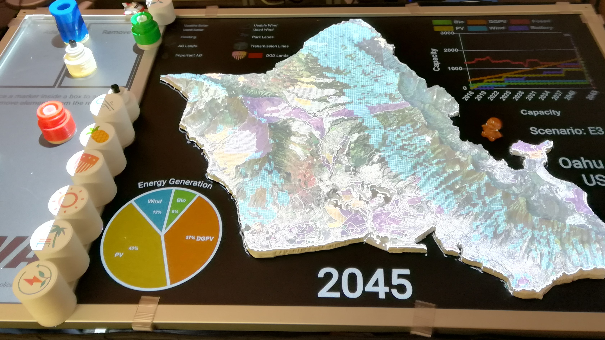

  

This 3d map was developed for the Hawaii state Energy office.  Its purpose is to describe possible renewable energy scenarios in a new and powerful way.  The map projects an image onto a 3d printed island of Oahu.  It overlays layers of data such as solar energy, wind energy, Agriultural lands, and DOD lands.  Different tangibles allow for user interaction such as advancing and retreating in time by year, changing the scenario, swapping between charts, and adding/removing layers.

I developed the design of the table and all of the functionalitym while working at LAVA, at UH Manoa.  LAVA is the Labratory for Advanced Visualization and Analytics.  All software is coded in javascript, HTML, and css and can run in any browser without an internet connection.  I worked in partnership with Ryan Theriot, who handled the layer data and charts.

The map software uses a JS library called aruco.js.  I 3d printed the AR markers and attached them to the tangibles I created that are illuminated with small usb flashlights that make it possible for cameras to detect the markers beneath the table.  The table software tracks the markers and uses the position of the corners to detect rotation, which makes it possible to twist them to change year, charts, and so on.

You can see how the table works on this video: <a href="https://youtu.be/IlBFM66nbN8">https://youtu.be/IlBFM66nbN8</a>

The map has traveled as far as Washington, DC where it was demoed at a national energy conference.  It has been featured on the local news, as well as in the UH Manoa newsletter.  The table is still under construction and I am currently in the process of modifying the tangible technology so that the flashlights are no longer needed.  We currently have interest in creating additional tables for NOAA and from HECO, and others.

