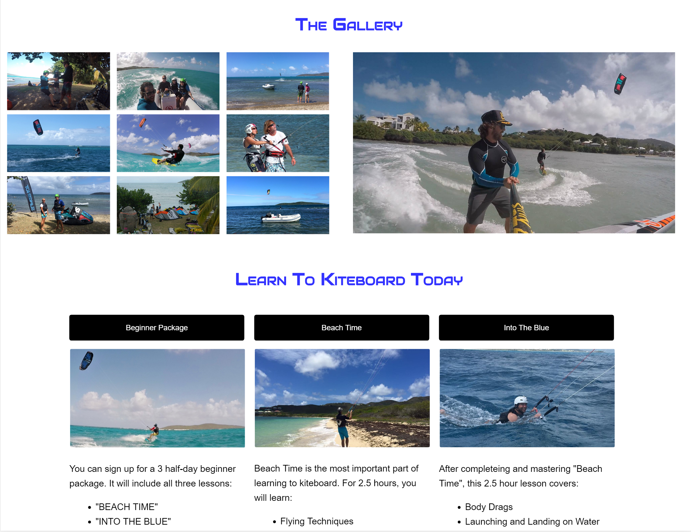

Kite St Croix is a kiteboaring school in the US Virgin Islands.  I built this website for them in 2014.  It is currently under construction as the Paddle Boarding Rental section of the business is no longer in operation and I have removed them from the website. 

I wrote all of the code for this website in pure HTML and CSS.  This is the second site that I built for the company.  With the first site, I had created a separate mobile and desktop site.  This was the first completely responsive site that I had made and I learned a lot about developing responsive sites.  
