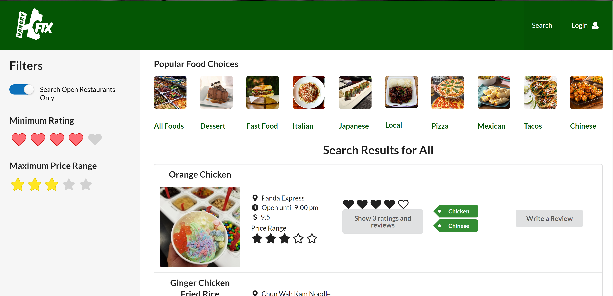

  

Hangry Fix was created as a final project for a Software Engineering course at UH Manoa.  It was one of the first projects where I worked together as a team using Github for project flow.  We created milestones and used issues to maintain a high level of organization and meet our deadlines.  The experience gave me insights on how to develop software as a team, even if the team was only three people.  

I personally wrote the code for the search page, the add food page, the add review page, and the edit review page, and helped on many others.  I was experienced in Javascript, HTML, and CSS before this project, but I had only just learned Meteor, Semantic UI, and react during the class this semester.  Combining these tools was a challenge that was rewarding to overcome.  I was able to share my knowledge with my teammates when they were stuck and likewise, I found that they had knowledge that helped me pass hurdles that slowed me down.

One of the greatest challenges I faced was working with eslint.  I have been writing Javascript code for years and I now had to change my style to match the standards.  I found it beneficial that all three of us in the group were using the same style, as reading code that my teammates had written was easier than it would have been otherwise.

